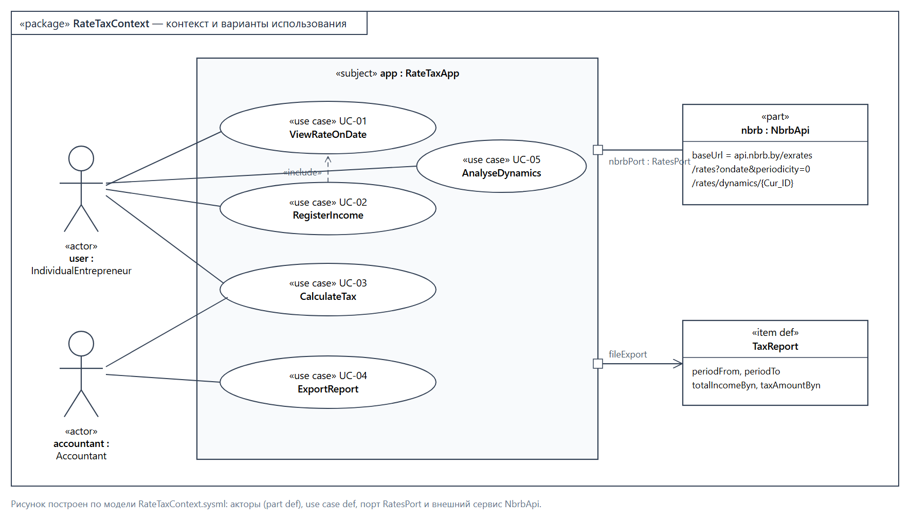
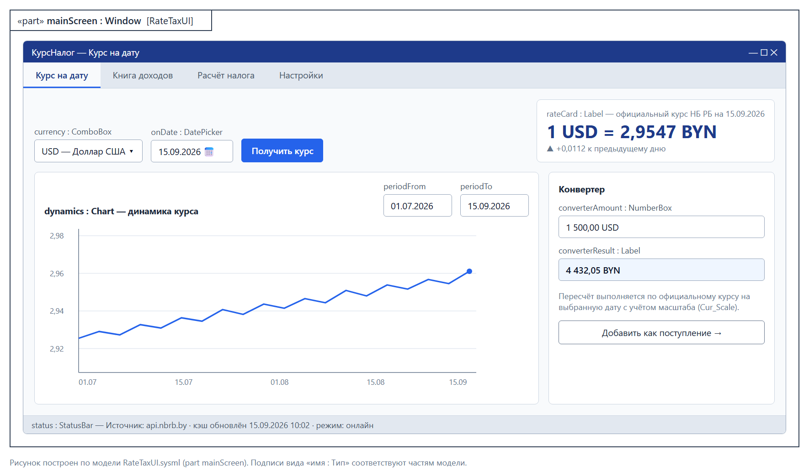
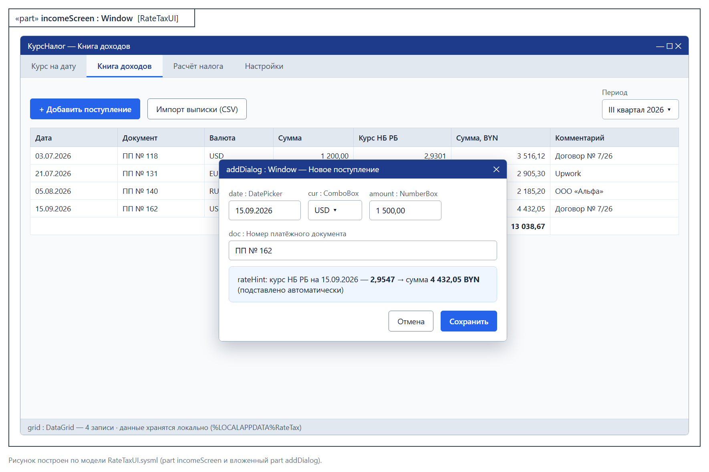
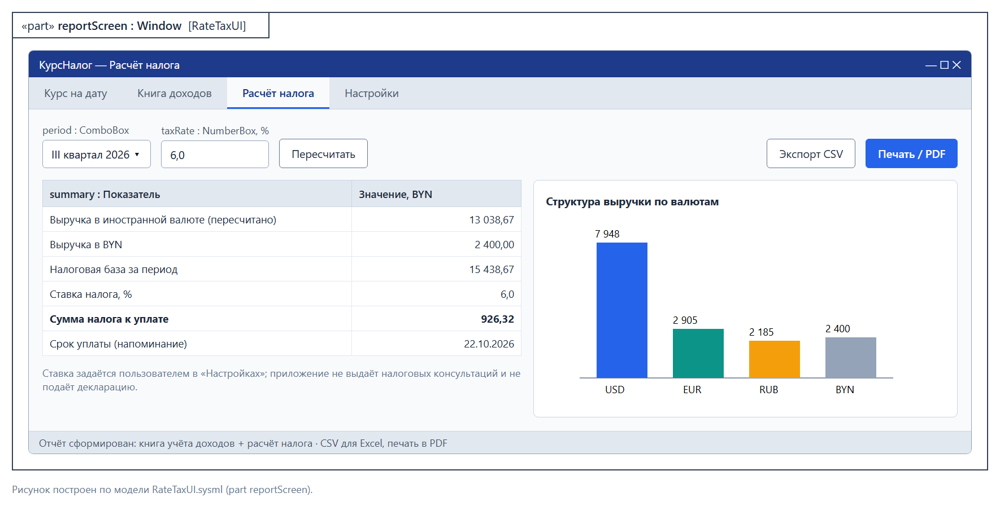

# Спецификация требований к ПО

Для «КурсНалог» (RateTax) — приложение архивных курсов валют для расчёта налогообложения индивидуального предпринимателя

Версия 0.1

Подготовил Шурхай Николай Александрович, гр. 434701

БГУИР, кафедра ЭВМ

07.10.2026

## Оглавление

<!-- TOC -->
* [1. Введение](#1-introduction)
  * [1.1 Назначение документа](#11-document-purpose)
  * [1.2 Область применения продукта](#12-product-scope)
  * [1.3 Определения, акронимы и сокращения](#13-definitions-acronyms-and-abbreviations)
  * [1.4 Ссылки](#14-references)
  * [1.5 Обзор документа](#15-document-overview)
* [2. Обзор продукта](#2-product-overview)
  * [2.1 Перспектива продукта](#21-product-perspective)
  * [2.2 Функции продукта](#22-product-functions)
  * [2.3 Ограничения продукта](#23-product-constraints)
  * [2.4 Характеристики пользователей](#24-user-characteristics)
  * [2.5 Допущения и зависимости](#25-assumptions-and-dependencies)
  * [2.6 Распределение требований](#26-apportioning-of-requirements)
* [3. Требования](#3-requirements)
  * [3.1 Внешние интерфейсы](#31-external-interfaces)
  * [3.2 Функциональные требования](#32-functional)
  * [3.3 Качество обслуживания](#33-quality-of-service)
  * [3.4 Соответствие стандартам](#34-compliance)
  * [3.5 Проектирование и реализация](#35-design-and-implementation)
  * [3.6 ИИ/МО](#36-aiml)
* [4. Верификация](#4-verification)
* [5. Приложения](#5-appendixes)
<!-- TOC -->

## История изменений

| Name | Date | Reason For Changes | Version |
|------|------|--------------------|---------|
| Шурхай Н.А. | 07.10.2026 | Первичная версия по итогам интервью с Заказчиком | 0.1 |

---

## 1. Введение {#1-introduction}

Документ описывает бизнес- и программные требования к desktop-приложению «КурсНалог», которое помогает индивидуальному предпринимателю (ИП), получающему выручку в иностранной валюте, пересчитывать её в белорусские рубли по официальному курсу Национального банка Республики Беларусь (НБ РБ) на дату поступления и рассчитывать налог за отчётный период.

### 1.1 Назначение документа {#11-document-purpose}

SRS фиксирует, **что** должна делать система «КурсНалог», и служит единым источником требований для Заказчика, разработчика, тестировщика и преподавателя (в роли бизнес-сообщества). Документ используется для согласования объёма работ, проектирования (SDD), разработки тестов и приёмки. Связанные документы: модели SysML v2 в каталоге [`sysml/`](sysml/) и мокапы интерфейса в каталоге [`img/`](img/).

### 1.2 Область применения продукта {#12-product-scope}

«КурсНалог» версии 1.0 — однопользовательское desktop-приложение для Windows. Бизнес-цели:

- **БЦ-1.** Сократить время ежеквартальной подготовки данных для налоговой декларации ИП с ~3 часов ручной работы до 15 минут.
- **БЦ-2.** Исключить ошибки пересчёта валютной выручки из-за неверной даты курса или неучтённого масштаба (например, курс за 100 RUB).
- **БЦ-3.** Предоставить подтверждаемый источник курсов (официальные данные НБ РБ) для обоснования расчётов перед налоговым органом.

**Входит в объём:** получение официальных курсов на дату и за период, ведение книги учёта доходов, автоматический пересчёт в BYN, расчёт налоговой базы и суммы налога по ставке, заданной пользователем, график динамики курса, экспорт отчётов.

**Не входит в объём:** подача декларации в налоговые органы, расчёт сложных налоговых режимов и льгот, бухгалтерский учёт расходов, банковские операции, мобильная и web-версии.

### 1.3 Определения, акронимы и сокращения {#13-definitions-acronyms-and-abbreviations}

| Term | Definition |
|------|------------|
| API | Application Programming Interface — набор определений и протоколов для интеграции ПО |
| BYN | Белорусский рубль, код ISO 4217 |
| Cur_ID | Внутренний идентификатор валюты в API НБ РБ |
| Cur_Scale | Количество единиц иностранной валюты, за которое установлен курс (1, 10, 100…) |
| ИП | Индивидуальный предприниматель |
| Книга учёта доходов | Журнал поступлений выручки с датой, суммой, валютой и суммой в BYN |
| НБ РБ | Национальный банк Республики Беларусь |
| Официальный курс | Курс белорусского рубля к иностранной валюте, установленный НБ РБ на дату |
| Поступление | Факт зачисления выручки на счёт ИП, подтверждённый платёжным документом |
| SRS | Software Requirements Specification — спецификация требований к ПО |
| SysML v2 | Systems Modeling Language v2 — язык системного моделирования (текстовая и графическая нотации) |
| UI | User Interface — пользовательский интерфейс |

### 1.4 Ссылки {#14-references}

| Документ | Владелец | Тип |
|----------|----------|-----|
| ISO/IEC/IEEE 29148:2018 Requirements engineering | ISO | нормативная |
| IEEE 830-1998 Recommended Practice for SRS | IEEE | справочная |
| API курсов валют НБ РБ, https://www.nbrb.by/apihelp/exrates | НБ РБ | нормативная (интерфейс) |
| OMG SysML v2.0 Specification | OMG | справочная |
| [`sysml/RateTaxContext.sysml`](sysml/RateTaxContext.sysml) — контекст и варианты использования | автор | справочная |
| [`sysml/RateTaxUI.sysml`](sysml/RateTaxUI.sysml) — прототип интерфейса | автор | справочная |

### 1.5 Обзор документа {#15-document-overview}

Раздел 2 описывает контекст продукта, пользователей и ограничения. Раздел 3 содержит верифицируемые требования с уникальными идентификаторами `REQ-[AREA]-[NNN]`. Раздел 4 — матрица верификации, раздел 5 — приложения (мокапы и протокол интервью). Изменения документа вносятся через pull request и фиксируются в «Истории изменений».

---

## 2. Обзор продукта {#2-product-overview}

### 2.1 Перспектива продукта {#21-product-perspective}

«КурсНалог» — новый самостоятельный продукт. Единственная внешняя зависимость — публичный REST API НБ РБ. Данные пользователя хранятся локально. Контекст системы и варианты использования показаны на рисунке 1 (модель `RateTaxContext.sysml`).

### 2.2 Функции продукта {#22-product-functions}

- **F1.** Просмотр официального курса выбранной валюты на дату (UC-01).
- **F2.** Ведение книги учёта доходов с автоматическим пересчётом в BYN (UC-02).
- **F3.** Расчёт налоговой базы и суммы налога за квартал/год (UC-03).
- **F4.** Экспорт книги доходов и расчёта в CSV (для Excel) и печать отчёта, в том числе в PDF (UC-04).
- **F5.** График динамики курса и конвертер валют (UC-05).
- **F6.** Локальный кэш курсов для работы без подключения к Интернету.

### 2.3 Ограничения продукта {#23-product-constraints}

- **C-1.** Приложение должно работать под Windows 10/11 (x64).
- **C-2.** Источником курсов должен быть только официальный API НБ РБ.
- **C-3.** Язык реализации — C++17; графический интерфейс — классический WinAPI (Win32): регистрация класса окна, `CreateWindowEx`, оконная процедура `WndProc`, цикл обработки сообщений, стандартные элементы управления (Button, Edit, ComboBox, ListView, Tab Control, DateTimePicker); отрисовка графиков — GDI; сетевое взаимодействие — WinINet; локальное хранилище — текстовые файлы данных UTF-8 (формат CSV) в каталоге `%LOCALAPPDATA%RateTax`; среда разработки — Microsoft Visual Studio Community 2022 (MSVC). Сторонние GUI-фреймворки (Qt, wxWidgets, MFC и т.п.) не используются.
- **C-4.** Персональные финансовые данные не должны передаваться на сторонние серверы.
- **C-5.** Срок разработки — один учебный семестр, команда — 1 человек.

### 2.4 Характеристики пользователей {#24-user-characteristics}

| Класс | Описание | Частота | Подготовка |
|-------|----------|---------|------------|
| ИП (основной) | Фрилансер/ИП, получает выручку в USD, EUR, RUB, CNY, PLN | 2–10 раз в месяц, пик — перед сроком декларации | Уверенный пользователь ПК, не бухгалтер |
| Бухгалтер (вторичный) | Готовит отчётность для ИП по выгрузкам | Раз в квартал | Профессионал в учёте |

Интерфейс — на русском языке, числа и даты — в формате ru-BY (`1 234,56`, `ДД.ММ.ГГГГ`).

### 2.5 Допущения и зависимости {#25-assumptions-and-dependencies}

| № | Допущение / зависимость | Влияние, если неверно |
|---|-------------------------|-----------------------|
| A-1 | API НБ РБ остаётся бесплатным и доступным без ключа | Потребуется другой источник или ручной ввод курса |
| A-2 | Формат ответа API (JSON, поля Cur_OfficialRate, Cur_Scale) не изменится | Потребуется доработка адаптера |
| A-3 | Ставку налога пользователь знает и вводит сам | Ошибка в расчёте налога вне ответственности ПО |
| A-4 | У пользователя есть Интернет хотя бы при первичной загрузке курсов | Без кэша пересчёт невозможен |

### 2.6 Распределение требований {#26-apportioning-of-requirements}

| Релиз | Требования |
|-------|------------|
| 1.0 (MVP, конец семестра) | REQ-FUNC-001…008, REQ-INT-001, REQ-PERF-001, REQ-SEC-001…002 |
| 1.1 | REQ-FUNC-009 (импорт CSV-выписки), REQ-FUNC-010 (график) |

---

## 3. Требования {#3-requirements}

### 3.1 Внешние интерфейсы {#31-external-interfaces}

#### 3.1.1 Пользовательские интерфейсы {#311-user-interfaces}

Интерфейс — одно главное окно с вкладками «Курс на дату», «Книга доходов», «Расчёт налога», «Настройки». Прототипы описаны в модели `RateTaxUI.sysml` и показаны на рисунках 2–4 (приложение 5.1). Все действия доступны с клавиатуры; минимальное разрешение окна — 1024×640.

#### 3.1.2 Аппаратные интерфейсы {#312-hardware-interfaces}

Специальных аппаратных интерфейсов нет.

#### 3.1.3 Программные интерфейсы {#313-software-interfaces}

- **ID:** REQ-INT-001
- **Title:** Получение курсов из API НБ РБ
- **Statement:** Система должна получать официальные курсы через HTTPS-запросы `GET https://api.nbrb.by/exrates/rates/{cur}?parammode=2&ondate=YYYY-MM-DD` и `GET https://api.nbrb.by/exrates/rates/dynamics/{Cur_ID}?startdate=…&enddate=…`.
- **Rationale:** Единственный официальный источник курсов (C-2).
- **Acceptance Criteria:** Для USD на 15.09.2026 значение совпадает с опубликованным на nbrb.by; при HTTP-ошибке или таймауте 10 с выводится сообщение и используется кэш.
- **Verification Method:** Test

### 3.2 Функциональные требования {#32-functional}

- **ID:** REQ-FUNC-001
- **Title:** Курс на дату
- **Statement:** Система должна по выбранной валюте и дате отображать официальный курс НБ РБ и масштаб (Cur_Scale).
- **Rationale:** БЦ-2, UC-01.
- **Acceptance Criteria:** Отображается «N {валюта} = X,XXXX BYN»; дата в будущем недоступна для выбора.
- **Verification Method:** Test

- **ID:** REQ-FUNC-002
- **Title:** Регистрация поступления
- **Statement:** Система должна позволять добавить поступление с полями: дата, валюта, сумма, номер документа, комментарий.
- **Rationale:** UC-02.
- **Acceptance Criteria:** Сумма > 0, дата не позже текущей; некорректный ввод подсвечивается, сохранение блокируется.
- **Verification Method:** Test

- **ID:** REQ-FUNC-003
- **Title:** Автоматический пересчёт в BYN
- **Statement:** Система должна при сохранении поступления подставлять курс НБ РБ на дату поступления и вычислять сумму в BYN = сумма × курс / Cur_Scale с округлением до копеек.
- **Rationale:** БЦ-2.
- **Acceptance Criteria:** 60 000 RUB при курсе 3,6420 за 100 RUB → 2 185,20 BYN.
- **Verification Method:** Test

- **ID:** REQ-FUNC-004
- **Title:** Редактирование и удаление записей
- **Statement:** Система должна позволять редактировать и удалять поступления с пересчётом итогов.
- **Rationale:** Исправление ошибок ввода.
- **Acceptance Criteria:** Удаление требует подтверждения; итоги обновляются сразу.
- **Verification Method:** Demonstration

- **ID:** REQ-FUNC-005
- **Title:** Расчёт налога за период
- **Statement:** Система должна для выбранного периода (квартал/год) рассчитывать налоговую базу (сумма поступлений в BYN) и сумму налога = база × ставка / 100.
- **Rationale:** БЦ-1, UC-03.
- **Acceptance Criteria:** База 15 438,67 BYN при ставке 6 % → налог 926,32 BYN.
- **Verification Method:** Test

- **ID:** REQ-FUNC-006
- **Title:** Настройка ставки налога
- **Statement:** Система должна позволять пользователю задать ставку налога в диапазоне 0–100 % с точностью 0,1.
- **Rationale:** A-3; приложение не выдаёт налоговых консультаций.
- **Acceptance Criteria:** Значение вне диапазона не принимается.
- **Verification Method:** Test

- **ID:** REQ-FUNC-007
- **Title:** Экспорт отчётов
- **Statement:** Система должна экспортировать книгу учёта доходов и расчёт налога за период в файл CSV (UTF-8 с BOM, разделитель «;»), открываемый в MS Excel, и выводить отчёт на печать средствами GDI; PDF формируется печатью на принтер «Microsoft Print to PDF».
- **Rationale:** UC-04, передача данных бухгалтеру.
- **Acceptance Criteria:** CSV-файл открывается в MS Excel без искажения кириллицы; PDF-файл открывается в программе просмотра PDF; суммы совпадают с экраном.
- **Verification Method:** Inspection

- **ID:** REQ-FUNC-008
- **Title:** Кэширование курсов
- **Statement:** Система должна сохранять каждый полученный курс в локальной базе и использовать его без повторного запроса.
- **Rationale:** Работа без Интернета (F6).
- **Acceptance Criteria:** При отключённой сети ранее запрошенные курсы отображаются с пометкой «из кэша».
- **Verification Method:** Test

- **ID:** REQ-FUNC-009
- **Title:** Импорт банковской выписки
- **Statement:** Система может импортировать поступления из CSV-выписки банка с сопоставлением колонок.
- **Rationale:** Сокращение ручного ввода (БЦ-1).
- **Acceptance Criteria:** Импорт файла с 50 строками без ошибок; дубликаты (дата+документ) пропускаются.
- **Verification Method:** Test

- **ID:** REQ-FUNC-010
- **Title:** Динамика курса и конвертер
- **Statement:** Система должна строить график курса выбранной валюты за период до 365 дней и пересчитывать произвольную сумму по курсу на дату.
- **Rationale:** UC-05.
- **Acceptance Criteria:** График строится по данным `/rates/dynamics`; конвертер совпадает с REQ-FUNC-003.
- **Verification Method:** Demonstration

### 3.3 Качество обслуживания {#33-quality-of-service}

#### 3.3.1 Производительность {#331-performance}

- **ID:** REQ-PERF-001
- **Statement:** Приложение должно работать быстро.

#### 3.3.2 Безопасность {#332-security}

- **ID:** REQ-SEC-001
- **Statement:** Система должна хранить данные только локально в профиле пользователя Windows и не передавать их третьим лицам (C-4).
- **Verification Method:** Inspection

- **ID:** REQ-SEC-002
- **Statement:** Все обращения к API должны выполняться по HTTPS с проверкой сертификата.
- **Verification Method:** Test

#### 3.3.3 Надёжность {#333-reliability}

- **ID:** REQ-REL-001
- **Statement:** Запись поступления должна сохраняться атомарно (запись во временный файл с последующей заменой основного); аварийное завершение не должно приводить к потере ранее сохранённых записей.
- **Verification Method:** Test

#### 3.3.4 Доступность {#334-availability}

Приложение доступно всегда, кроме функций, требующих API НБ РБ; при недоступности API работает в режиме кэша (REQ-FUNC-008).

#### 3.3.5 Наблюдаемость {#335-observability}

- **ID:** REQ-OBS-001
- **Statement:** Система должна вести журнал ошибок обращения к API (дата, URL, код ответа) в файле `%LOCALAPPDATA%\RateTax\logs`, без записи сумм пользователя.
- **Verification Method:** Inspection

### 3.4 Соответствие стандартам {#34-compliance}

Расчёты используют только официальные курсы НБ РБ (C-2). Отчёты содержат источник и дату курса для каждой записи. Документ оформлен по ISO/IEC/IEEE 29148.

### 3.5 Проектирование и реализация {#35-design-and-implementation}

#### 3.5.1 Установка {#351-installation}

Установка — копированием одного исполняемого файла `RateTax.exe` (внешние библиотеки не требуются: системные библиотеки WinAPI (user32, gdi32, comctl32, comdlg32, wininet) входят в состав Windows); права администратора не требуются.

#### 3.5.2 Сборка и поставка {#352-build-and-delivery}

Сборка — решение Visual Studio 2022 (`RateTax.sln`, конфигурация Release x64, набор инструментов MSVC v143); сторонние библиотеки не используются; исходный код хранится в репозитории GitHub, ветка `main`.

#### 3.5.3 Распределение {#353-distribution}

Не применимо (локальное приложение).

#### 3.5.4 Сопровождаемость {#354-maintainability}

Адаптер API НБ РБ выделяется в отдельный модуль с абстрактным классом `IRatesProvider` (C++); логика пересчёта и доступ к данным отделены от слоя WinAPI GUI (оконных процедур); покрытие модульными тестами (GoogleTest) логики пересчёта — не менее 80 %; стиль кода — C++ Core Guidelines, проверка clang-tidy.

#### 3.5.5 Повторное использование {#355-reusability}

Модуль `RatesProvider` оформляется как статическая библиотека (.lib) отдельного проекта решения Visual Studio и может быть переиспользован в других проектах курса.

#### 3.5.6 Переносимость {#356-portability}

Поддерживается только Windows x64 (C-1).

#### 3.5.7 Стоимость {#357-cost}

Бесплатные инструменты и сервисы (Visual Studio Community 2022); сторонние библиотеки не используются, поэтому лицензионные ограничения отсутствуют.

#### 3.5.8 Сроки {#358-deadline}

| Этап | Срок |
|------|------|
| Согласование SRS | лабораторная работа № 3 |
| Проектирование (SDD) | лабораторная работа № 4 |
| MVP 1.0 | конец семестра |

#### 3.5.9 Доказательство концепции {#359-proof-of-concept}

PoC: консольная утилита на C++ (WinINet), получающая курс USD на дату из API НБ РБ, — для проверки формата ответа и времени отклика.

#### 3.5.10 Управление изменениями {#3510-change-management}

Изменения требований вносятся через pull request в ветку `lab3`; Заказчик и преподаватель оставляют комментарии к PR; принятые изменения повышают версию документа.

### 3.6 ИИ/МО {#36-aiml}

Не применимо: система не использует компоненты машинного обучения.

---

## 4. Верификация {#4-verification}

| Requirement ID | Verification Method | Test/Artifact Link | Status | Evidence |
|----------------|---------------------|--------------------|--------|----------|
| REQ-INT-001 | Test | tests/IntegrationNbrb.md | Planned | |
| REQ-FUNC-001 | Test | tests/UC01.md | Planned | |
| REQ-FUNC-003 | Test | tests/UC02.md | Planned | |
| REQ-FUNC-005 | Test | tests/UC03.md | Planned | |
| REQ-FUNC-007 | Inspection | tests/UC04.md | Planned | |
| REQ-FUNC-008 | Test | tests/Offline.md | Planned | |
| REQ-SEC-001 | Inspection | — | Planned | |

---

## 5. Приложения {#5-appendixes}

### 5.1 Прототипы интерфейса (SysML v2)

### 5.2 Протокол интервью с Заказчиком (кратко)

| Вопрос Менеджера | Ответ Заказчика |
|------------------|-----------------|
| Кто будет пользоваться приложением? | Я как ИП-фрилансер; иногда мой бухгалтер. |
| Какую проблему решаем? | Каждый квартал вручную ищу курсы на nbrb.by для каждого платежа и пересчитываю в Excel — долго и бывают ошибки. |
| Какие валюты нужны? | USD, EUR, RUB, иногда CNY и PLN; пусть можно выбрать. |
| Нужен ли расчёт налога? | Да, по ставке, которую я сам укажу. |
| Что на выходе? | Таблица для бухгалтера и PDF «для себя». |
| Нужен ли Интернет постоянно? | Желательно, чтобы работало и без него. |
